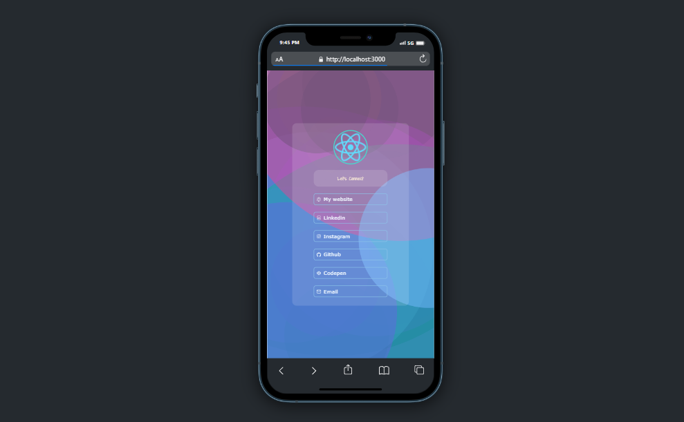

# Getting Started with Create React App

## About The Project

 

- This linktree to includes links to your Channels , your social media profiles, and your website. It is a convenient way for readers to find more information about you and your work.
  I hope this helps!

(<a href="#readme-top">back to top</a>)

### Built With

This section should list any major frameworks/libraries used to bootstrap your project. Leave any add-ons/plugins for the acknowledgements section. Here are a few examples.

- [![React][React.js]][React-url]

## Installation

To install this project, you will need to:

1. Clone the repository.
2. Install the dependencies.
3. Run the application.

### `npm run start`

<!-- MARKDOWN LINKS & IMAGES -->
<!-- https://www.markdownguide.org/basic-syntax/#reference-style-links -->
[React.js]: https://img.shields.io/badge/React-20232A?style=for-the-badge&logo=react&logoColor=61DAFB
[React-url]: https://reactjs.org/
